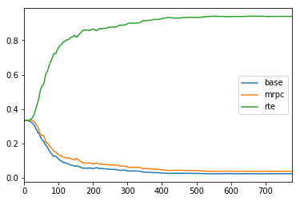

# Adapters / Multi-Adapters

This README goes over the procedure for tuning single-task [adapters](https://arxiv.org/abs/1902.00751), and then using them jointly in a multi-adapter format that learns how to weight pretrained single-task adapters.

### 0. Choose the working directory

Re-use `NLPR_BASE_DIR` from [Simple Setup](simple_setup.md), which has our standard task and model configurations, weights and data. Set our working directory:

```bash
export NLPR_ADAPTER_DIR=${NLPR_BASE_DIR}/working/adapters/
mkdir -p ${NLPR_ADAPTER_DIR}/configs
``` 

### 1. Fine-tune Single-task Adapters

We'll fine-tune RoBERTa-base Adapters on two GLUE tasks: RTE and MRPC.

```bash
python \
    nlpr/proj/adapters/runscript.py \
	--ZZsrc ${NLPR_BASE_DIR}/models/roberta-base/config.json \
	--task_config_path ${NLPR_BASE_DIR}/data/nlpr_data/configs/mrpc.json \
    --train_batch_size 4 \
    --learning_rate 1e-4 \
    --num_train_epochs 5 \
    --force_overwrite \
    --do_save --do_train --do_val \
    --eval_every_steps 500 \
    --partial_eval_number 500 \
    --output_dir ${NLPR_ADAPTER_DIR}/single/mrpc

python \
    nlpr/proj/adapters/runscript.py \
	--ZZsrc ${NLPR_BASE_DIR}/models/roberta-base/config.json \
	--task_config_path ${NLPR_BASE_DIR}/data/nlpr_data/configs/rte.json \
    --train_batch_size 4 \
    --learning_rate 1e-4 \
    --num_train_epochs 5 \
    --force_overwrite \
    --do_save --do_train --do_val \
    --eval_every_steps 500 \
    --partial_eval_number 500 \
    --output_dir ${NLPR_ADAPTER_DIR}/single/rte
```

After the runs are completed, each of the output directories should contain a `model.p` pickle that contains the tunable weights (i.e. Adapter weights and the classifier heads). 

### 2. Write a configuration JSON pointing to the single-adapter model weights.

Write a JSON file that looks like (**be sure to replace the actual paths**):

```json
{
  "rte": "${NLPR_ADAPTER_DIR}/single/rte/model.p",
  "mrpc": "${NLPR_ADAPTER_DIR}/single/mrpc/model.p"          
}
```

and save this to `${NLPR_ADAPTER_DIR}/configs/adapter_weights.json`

### 4. Fine-tune Multi-Adapter

Next, we fine-tune our multi-adapter. As a sanity check, we will use RTE as the target task; ideally, the model should identify the already-trained RTE single-task adapter as the best adapter to use. 

```bash
python \
    nlpr/proj/adapters/runscript_multi_adapter.py \
	--ZZsrc ${NLPR_BASE_DIR}/models/roberta-base/config.json \
	--task_config_path ${NLPR_BASE_DIR}/data/nlpr_data/configs/mrpc.json \
    --train_batch_size 4 \
    --learning_rate 1e-3 \
    --num_train_epochs 5 \
    --force_overwrite \
    --do_train --do_val \
    --eval_every_steps 500 \
    --partial_eval_number 500 \
    --adapter_weights_path ${NLPR_ADAPTER_DIR}/configs/adapter_weights.json \
    --adapter_num_weight_sets 1 \
    --adapter_ft_mode base \
    --adapter_use_optimized 1 \
    --adapter_include_base 1 \
    --adapter_include_flex 0 \
    --output_dir ${NLPR_ADAPTER_DIR}/multi/rte
```

### 5. Check our Multi-Adapter Adapter-weights

In the Multi-Adapter output directory, we log the weights on each single-task adapter, as well as the base residual connection, over time. We can run the following Python code to plot the weights over the course of training (**be sure to replace the actual paths**):

```python
import matplotlib.pyplot as plt
import pandas as pd
import nlpr.itools.viewlogs as viewlogs

loaded = viewlogs.get_latest_log("${NLPR_ADAPTER_DIR}/multi/rte")
plot_df = pd.DataFrame([d["weights"][f"layer_00"] for d in loaded["weights"]])
plot_df.plot()
```

You should get a plot that looks something like this:


